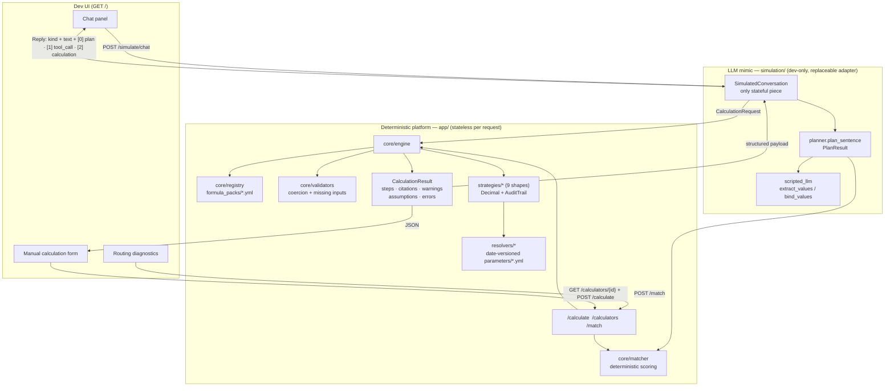

# Current System Flow — Calculation Platform

Snapshot of `calculation_platform/` on branch `feature/calculate-module`,
2026-07-28. Everything documented here is **implemented and verified live**
unless explicitly marked *proposed*.

## Components and responsibilities

| Component | Files | Responsibility |
|---|---|---|
| FastAPI app | `app/main.py` | Builds the singletons (registry, parameter store, engine) at import time, wires them into the API and UI routers via `set_engine()` |
| API router | `app/api/routes.py` | `GET /health`, `GET /calculators`, `GET /tool-schemas`, `GET /calculators/{calculator_id}/tool-schema`, `GET /calculators/{id}`, `POST /calculate`, `GET /calculations`, `GET /calculations/{request_id}`, `GET /calculations/{request_id}/report`, `POST /calculations/{request_id}/replay`, `POST /match` |
| Dev UI + dev routes | `app/ui.py` | Serves the single-page UI at `GET /`; dev-only `POST /plan`, `POST /simulate/chat`, `POST /simulate/reset` |
| Registry | `app/core/registry.py` | Loads all `formula_packs/**/*.yml` into `CalculatorDefinition`s at startup; structural validation via `app/core/definition_validator.py` fails fast on malformed packs |
| Input validation | `app/core/validators.py` | Type coercion (Decimal, int, strict boolean, ISO date, string), defaults recorded as assumptions, min/max bounds, `input_invalid` errors listing every missing required input |
| Parameter store | `app/resolvers/parameter_store.py` | Loads `parameters/**/*.yml` as date-versioned `ParameterValue`s; lookup by date, by tax year, or all ranges overlapping a period |
| Parameter resolution | `app/resolvers/date_parameter_resolver.py` | Priority: caller-supplied > store-by-date > static default; returns values plus full provenance and the `date_resolution` record |
| Engine | `app/core/engine.py` | Orchestrates definition → validation → strategy → result; converts every `PlatformError` into a structured error result; adds parameter-verification staleness warnings |
| Strategies | `app/strategies/` | Nine calculation shapes registered in `STRATEGIES`; all arithmetic in `Decimal`, rounding through `result_builder.round_decimal`/`round_output`, steps via `core/audit.AuditTrail` |
| Matcher | `app/core/matcher.py` | Deterministic free-text → calculator scoring (phrases +3, tokens +1, negative examples −4); statuses `matched`/`ambiguous`/`no_match` |
| LLM mimic | `simulation/planner.py`, `simulation/scripted_llm.py`, `simulation/conversation.py` | Deterministic stand-in for the future LLM: routing (via the real matcher), naive value extraction, clarification loop, prose synthesis. Never computes results |
| Catalog artifact | `simulation/catalog.py` | Renders the calculator catalog as the text block a future LLM system prompt would embed (nothing consumes it yet — it is the visible integration contract) |
| CLI demos | `simulation/demo.py`, `simulation/scenarios.py` | Interactive conversation and three canonical scripted scenarios |
| Citation verifier | `scripts/verify_citations.py` | Fetches URL-backed parameter citations and stamps `last_verified_at` |

## Entry points

- HTTP: `uvicorn calculation_platform.app.main:app` (API + UI in one process).
- CLI: `simulation/demo.py` (interactive), `simulation/scenarios.py` (scripted).
- Tests: `pytest calculation_platform/tests` (301 passing; `conftest.py` puts
  `calculation_platform/` on `sys.path` so `app` and `simulation` import as
  top-level packages).

## Request schema (`app/schemas/calculation_request.py`)

```jsonc
POST /calculate
{
  "calculator_id": "legal_it.irpef",          // required
  "inputs": {"taxable_income": 42000},        // named inputs per definition
  "tax_year": 2026,                           // optional regime selector
  "as_of_date": "2026-12-31",                 // optional, wins over tax_year
  "period": {"start_date": "...", "end_date": "..."},  // date-range calculators
  "caller_supplied_values": {"legal_interest_rate": 0.03}, // parameter overrides
  "options": {"explain": true, "rounding": null, "require_sources": false},
  "request_id": null, "jurisdiction": null, "tenant_id": null  // reserved
}
```

## Response schema (`app/schemas/calculation_result.py`)

```jsonc
{
  "status": "success" | "error",
  "result": {"gross_tax": 11060.0},
  "formula_used": "legal_it.irpef", "formula_version": "1",
  "raw_inputs": {...},          // exactly as sent, kept even on error
  "inputs_used": {...},         // after coercion/defaults
  "parameters_used": {          // per parameter: value + provenance
    "brackets": {"origin": "parameter_store", "parameter_id": "...",
                  "effective_from": "...", "effective_to": "...",
                  "official": true, "last_verified_at": "...", "citations": [...]}
  },
  "date_resolution": {"as_of_date": "2026-12-31",
                       "source": "explicit_as_of_date|derived_from_tax_year|defaulted_to_today"},
  "derived_values": {...},
  "steps": [{"step": 1, "type": "bracket", ...}],   // ordered audit trail
  "citations": [{"reference": "...", "official": true, ...}],
  "warnings":    [{"code": "definition|calculation|parameter_verification_*", "message": "..."}],
  "assumptions": [{"code": "definition|input_default|calculation", "message": "..."}],
  "errors": [{"code": "...", "message": "...", "details": {...}}]  // when status=error
}
```

Error codes (`app/core/errors.py`): `calculator_not_found`, `definition_invalid`
(startup only), `input_invalid`, `parameter_unresolved`,
`strategy_execution_failed`. `/calculate` always answers HTTP 200 with
`status: "error"` for domain failures; HTTP 422 only for requests that don't
parse as `CalculationRequest` at all; `GET /calculators/{id}` 404s for unknown ids.

## Mimic schemas

- `PlanResult` (`simulation/planner.py`): `status` (`ready_to_calculate` /
  `needs_clarification` / `ambiguous` / `no_match`), `calculator_id`,
  `extracted_values` (raw), `normalized_inputs`/`inputs` (bound), `tax_year`,
  `period`, `missing_inputs`, `question`, `confidence`, `matched_terms`,
  `candidates`, `required_context`.
- `SimulatedToolCall` (`simulation/scripted_llm.py`): `calculator_id`, `inputs`,
  `tax_year`, `period` — exactly one structured `/calculate` request.
- `Reply` (`simulation/conversation.py`): `kind`
  (`answer`/`question`/`ambiguous`/`no_match`), `text`, optional `calculation`
  (full `CalculationResult`), `tool_call`, `plan`.
- `/simulate/chat` wire format: request `{"message": str}`; response
  `{"kind", "text", "tool_call", "calculation", "plan"}`.

## Flow diagram



## Error and missing-information paths

- **Unknown calculator** → `calculator_not_found` (with available ids in details).
- **Missing required named input** → `input_invalid` +
  `details.missing_inputs: [names]`. The conversation layer turns this into a
  clarifying question and retries with the user's follow-up. Verified:
  `quanto pago di irpef nel 2026?` → question → `il reddito è di 42000 euro` → answer.
- **Invalid value** (uncoercible, or outside declared min/max) → `input_invalid`
  + `details.input/value`. The conversation drops the bad value and asks for a
  correction using the platform's own message.
- **Missing period** (date-range calculators) → the mimic pre-checks
  (`conversation.py:112`) and asks; if `/calculate` is hit directly without a
  period the strategy raises `strategy_execution_failed` (see assessment G3 —
  weaker than the named-input signal; *proposed* to become structured
  missing-information at platform level).
- **Parameter table doesn't cover the period** → `parameter_unresolved` with a
  refusal message (never a silently smaller number). Verified live for a
  2026→2027 interest period.
- **Official parameter without / with stale verification stamp** → warnings
  `parameter_verification_missing` / `_stale` / `_invalid` on an otherwise
  successful result.
- **No routing match** → `no_match` ("the platform does not guess"); ties →
  `ambiguous` with at most 3 candidates for the user to choose from. (Known
  weakness: generic question words can turn unrelated sentences into
  `ambiguous` — assessment G4.)
- **Date-typed required inputs via chat** → currently an unrecoverable question
  loop (assessment G1; the selected next task). Manual form and raw API work.

## Parameter-resolution path

For each `ParameterRef` in the definition: `caller_supplied_values[name]` if
present (origin `caller_supplied`) → else store lookup by the resolved as-of
date (origin `parameter_store`, with source, effective range, citations,
verification stamp) → else the ref's static default (origin `static_default`)
→ else `parameter_unresolved`. The as-of date comes from `as_of_date` →
`date(tax_year, 12, 31)` → today, and how it was chosen is recorded in
`date_resolution`. `date_split_interest` and `ravvedimento` additionally fetch
*all* rate ranges overlapping the period and split the computation per segment,
refusing if coverage is incomplete.

## Calculation-trace path

Strategies record numbered typed steps through `AuditTrail`
(`{"step": n, "type": "...", ...detail fields}`); the engine assembles them
with inputs (raw and coerced), parameters with provenance, derived values,
citations from the definition, warnings (definition + calculation + parameter
verification), and assumptions (definition + applied defaults + calculation).
The UI shows the full JSON in collapsible sections; the chat synthesis line
`(Calcolo verificabile: N passaggi registrati.)` advertises the trace.

## UI rendering path

- **Chat panel:** each assistant message gets a kind badge (risposta / domanda /
  ambiguo / nessun calcolo) and up to three collapsible payloads: `[0]` the
  planner's `PlanResult`, `[1]` the structured tool call (what the LLM would
  POST to `/calculate`), `[2]` the platform's full `CalculationResult`.
  Suggestion chips are generated from each calculator's own routing metadata.
- **Routing diagnostics:** `/match` candidates with scores, matched terms, and
  still-required inputs; one click opens the candidate in the manual form.
- **Manual form:** fields generated from `GET /calculators/{id}` (typed inputs,
  optional tax_year/as_of_date, period fieldset shown for `date_split_interest`
  packs, caller_supplied_values JSON override); renders result table, steps,
  citations, warnings, and the full response JSON.

## LLM mimic behavior

`plan_sentence` routes via the real matcher, extracts numbers (Italian formats),
one tax-year candidate, ISO-date pairs (→ period), yes/no words, and a few
phrase-triggered boolean hints; `bind_values` fills missing required
decimal/integer/boolean inputs in declaration order (rate>1 → ÷100, monthly
rent → ×12). The conversation holds at most one pending tool call, merges
follow-up answers into it, and either answers (with synthesis of result,
sources, warnings, assumptions), asks (from the platform's structured errors),
offers candidates (ambiguous), or honestly declines (no_match / other errors).
Extraction is deliberately naive — it is a test fixture standing where the real
LLM will sit, and `PlanResult`/`SimulatedToolCall` are the contracts the real
adapter must keep.

## Manual execution

Exact commands, verified against the repository (run from the repo root
the repository root):

```bash
# Start the API + dev UI (then open http://localhost:8802/ and http://localhost:8802/docs)
.venv/bin/uvicorn calculation_platform.app.main:app --reload --port 8802

# Run the whole test suite (301 tests)
.venv/bin/python -m pytest calculation_platform/tests -v

# Scripted three-scenario demo (happy path / clarification / ambiguity)
.venv/bin/python calculation_platform/simulation/scenarios.py

# Interactive CLI conversation
.venv/bin/python calculation_platform/simulation/demo.py

# One-shot CLI conversation
.venv/bin/python calculation_platform/simulation/demo.py "quanto pago di tasse su un reddito di 42000 euro nel 2026"

# Verify/stamp parameter citations (network access required)
.venv/bin/python calculation_platform/scripts/verify_citations.py --dry-run
```
